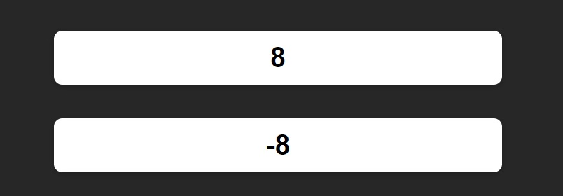

# Practising Custom Hooks in React

This is a web app created just for practising custom hooks in React.

## Features

### 1. Counters
This is the only page. It shows two counters, one counts forward (+1 per second) and the other counts backwards.
