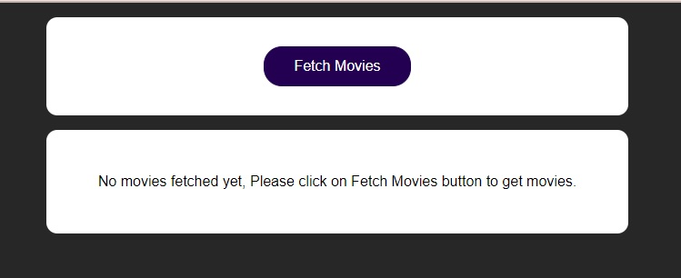
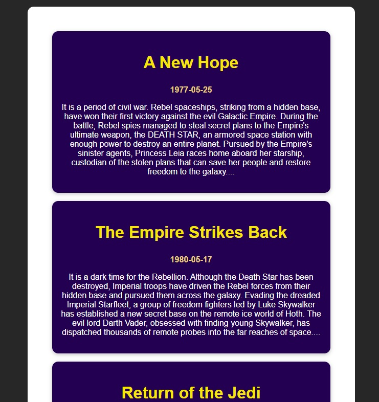

# Star Wars Movie List

This is a web app which helps you to add/view a list of Star Wars Movies.

## Main Topics

Following are the main topics around which this web app was built - 

- GET request
- Async/ await
- Handling loading states
- Handling Http Errors

## React/JS Topics covered

Following React/JS topics are covered in this web app - 

- Reusable functional components
- useState, useEffect, useCallback Hook
- Functions as props
- Reusable UI components
- Inline css/ style prop
- Spread operator
- Array/ object destructuring
- Event handling
- Array filter()/ map()
- Conditional rendering
- Forms
- Two way binding
- Children prop

## Features
Following features are available in this web app - 

### 1. Main page/ fetch-movies page
This page allows you to fetch movies.

### 2. Show-movies
Here, you can view the movies list.

### 3. Loading...
This is shown while data is being fetched.

### 4. Error handling
This is shown if there is some error in fetching data.
